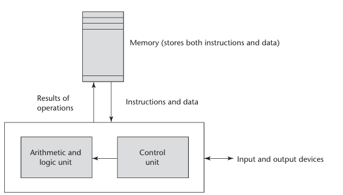

# Introduction: Preliminaries

Language
- Set of strings, sentences, statements

Grammar
- Syntax (Structure)
- Semantics (Meaning)

--

(From Textbook)

## 1.1 Reasons for Studying Concepts of Programming Languages

- Increased capacity to express ideas
- Improved background fro choosing appropriate languages
- Increased ability to learn new languages
- Better understand the significance of implementation
- Better use of languages that are already known
- Overall advancement of computing

## 1.2 Programming Domains

- Scientific applications
    - Large number of floating point computations
    - Fortran (FORmula TRANslating)
- Business applications
    - Produce reports, decimal numbers and characters
    - COBOL (COmmon Business Oriented Language)
- Artificial Intelligence
    - Symbols rather than numbers manipulated
    - LISP (LISt Processing)
    - PROLOG (LOGic PROgramming)
- Web Software
    - Eclectic collection of languages, ranging from markup languages to general-purpose programming languages
    - Need for dynamic Web content ^
    - HTML
    - PHP

## 1.3 Language Evaluation Criteria

### 1.3.1 Readability

Readability problems occur whenever the program's author has learned a different subset from that subset with which the reader is familiar.

#### 1.3.1.1 Simplicity

Too many features make the language difficult to learn, but not enough may make it less readable. (Assembly, simple but harder to read)
- Manageable set of features and constructs
- Minimal feature multiplicity
- Minimal operator overloading

#### 1.3.1.2 Orthogonality (No overlap)

Meaning of an orthogonal language feature is independent of the context of its appearance in the program.
Functional languages offer potentially the greatest overall simplicity, as the function call can be combined with other function calls.

#### 1.3.1.3 Data Types

Defining data types and data structures in a language is another significant aid to readability.

    
        timeOut = 1
            
        timeOut = true
    

The first statement is unclear with what it represents where as the second statement is clearer.

#### 1.3.1.4 Syntax Design

Syntax, or form, of the elements of a language has a significant effect on the readability of programs.
- Special words
    - Can cause confusion if too little or too much
    - End braces can get confusing if there are too many
    - Ex: while, class, for, end if, ...
- Form and meaning
    - Designing statements so that their appearance at least partially indicates their purpose is an obvious aid to readability

### 1.3.2 Writability

Measure of how easily a language can be used to create programs for a chosen problem domain.

#### 1.3.2.1 Simplicity and Orthogonality

If large number of different constructs, can lead to misuse/disuse of features. So smaller number and consistent set of rules for combining them is better than larger number of primitives.
Although, too much orthogonality can lead to errors undiscovered by the compiler.

#### 1.3.2.2 Expressivity

Refers to several different characteristics, more commonly known as that a language has relatively convenient ways of specifying computations.

        count++
        count = count + 1

The first way is more convenient and shorter.

-- 

(Not Textbook)

Abstraction

The ability to define and use complicated structures or operations in ways that allow many details to be ignored.

--

(From Textbook)

### 1.3.3 Reliability

#### 1.3.3.1 Type Checking

Type checking is testing for type errors in a given program either through the compiler or during program execution.
Checking at compile-time is more desirable as checking as run-time is more expensive.

#### 1.3.3.2 Exception Handling

Ability of a program to intercept run-time errors, take corrective measures, and continue on

#### 1.3.3.3 Aliasing

Having two or more distinct names in a program that access the same memory cell (known as a dangerous feature).

### 1.3.4 Cost

Total cost of a programming language can be defined by many characteristics.

Cost of:
- Training programmers to use the language
- Writing programs in the language
- (Can be reduced in a good programming environment)
- Compiling programs in the language
- Executing programs written in a language is greatly influenced by the language's design
- (Optimization can help to decrease the size or increase the execution speed)
- The language implementation system
- Poor reliability
- Software maintenance

Overall, three most important are:
- Program development, maintenance and reliability

There are number of other criteria like:
- Portability
- Generality
- Well-definedness
But most criteria are not precisely defined nor precisely measurable. Still they are useful and provide insight.

## 1.4 Influences on Language Design

### 1.4.1 Computer Architecture 
von Neumann Architecture was a dominant computer architecture that languages were developed around. These languages are called imperative languages. Data and programs are stored in the same memory and instructions must be transmitted between memory and the CPU.

The architecture works on the fetch-execute cycle. The address of the next instruction send to the CPU is maintained in a register called the program counter.

This design has a bottle neck bus size as data is transferred between memory and CPU.

### 1.4.2 Programming Design Methodologies

There was a switch from hardware to software. As well as a shift from procedure-oriented to data oriented program design methodologies. Object-oriented methodology, first data abstraction (encapsulates), inheritance and dynamic method binding.

## 1.5 Language Categories

Languages are categorized into four bins:
- Imperative
- Functional
- Logic
- Object-Oriented* (Not really its own separate category)

Imperative
- Central features are variables, assignment statements, and iteration

Functional
- The main way to do computation is to apply a function to the given parameters
- Lambda calculus

Logic
- Rule based but in no particular order

Markup/programming hybrid (Protocols)
- Used to support some other programming

## 1.6 Language Design Trade-Offs

Reliability vs Cost of Execution
- Example: Java demands that all references to array elements be checked to ensure index or indices are in legal ranges but that adds great deal to the cost of execution

Readability vs Writability
- My Own Example: MIPS gets down to the 'nitty-gritty' and allows you to do what you want when programming, but at the cost of poor readability

Writability (Flexibility) vs. Reliability
- Example: C++ pointers are very flexible in addressing of data but can be potentially unreliable and cause unintentional behavior.

--

