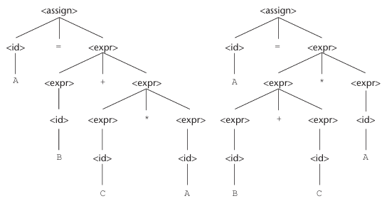

# Describing Syntax and Semantics && Lexical and Syntax Analysis

## 3.1 Introduction

Syntax of a programming language is the form of its expressions, statements, and program units.

Semantics is the meaning of those expressions, statements, and program units.

An example is Java 'while' statement...

        while(condition){
            body;
        }

The semantics of this would be if the condition is true, the body of the while would be executed.

## 3.2 The General Problem of Describing Syntax

Formal descriptions of the syntax of programming languages often do not include descriptions of the lowest-level syntactic units. These small units are called lexemes. They include its numeric literals, operators, and special words, among others.
Lexemes can be partitioned into groups called identifiers; each group is represented by a name/token.

For example:

        index = 2 * count + 17;

The lexemes and tokens of this statement are:

|Lexeme | Token |
|---|---|
|index|identifier|
|=|equal_sign|
|2|int_literal|
|*|mult_op|
|count|identifer|
|+|plus_op|
17|int_literal|
|;|semicolon|

### 3.2.1 Language Recognizers && 3.2.2 Language Generators

Languages can be formally defined in two distinct ways: recognition and by generation. 

Recognizers
- A recognition device reads input strings over the alphabet of the language and decides whether the input string belong to the language
- This would be like the syntax analysis part of a compiler

Generators
- A device that generates sentences of a languages
- Determine if the syntax of a particular sentence is syntactically correct by comparing it to the structure of the generator

## 3.3 Formal Methods of Describing Syntax

Formal language-generation mechanisms, grammar, used to describe the syntax of programming languages

### 3.3.1 Backus-Naur Form and Context-Free Grammars

#### 3.3.1.1 Context-Free Grammars

Noam Chomsky described four classes of generative devices or grammars that define four classes of languages. Two of them were called context-free and regular. His work was applied later to programs.

#### 3.3.1.2 Origins of Backus-Naur Form

Backus-Naur Form (BNF) is a formal notation for specifying programming language syntax. Some what identical to Chomsky's generative devices for context-free languages (context-free grammars).

#### 3.3.1.3 Fundamentals

Metalanguage is a language to describe another language. BNF is a metalanguage for programming languages.

        <assign> -> <var> = <expression>

The text on the left side of the arrow, is called the left-hand side (LHS).

The text to the right of the arrow is the definition of LHS. It is called the right-hand side (RHS) and consists of some mixture of tokens, lexemes, and references to other abstractions.

Altogether, the definition is called the rule/production.

Abstractions, seen using '<>', are often called non-terminal symbols, where as lexemes and tokens of the rules are called terminal symbols. A BNF description or grammar, is a collection of rules.

#### 3.3.1.4 Describing Lists

Variable-length lists in math is often written using ellipsis. BNF does not use this, the alternative is recursion. A rule is recursive if LHS appears in its RHS.

        <ident_list> -> identifier
                      | identifier, <ident_list>

#### 3.3.1.5 Grammars and Derivations 

A special non-terminal of the grammar is called the start symbol. This sequence of rule application is called a derivation.

The derivation in the example shows using the grammar to get to the sentence: 'begin A = B + C; B = C end'.
Each of the strings in the derivation is called a sentential form. In this derivation, the replaced non-terminal is always the leftmost-non-terminal; this is called leftmost derivations.

#### 3.3.1.6 Parse Trees

Grammar also naturally describes the hierarchical syntactic structure of the sentences of the languages they define. They are called parse trees.

This is an example showing the hierarchy using a parse tree.

#### 3.3.1.7 Ambiguity

A grammar that generates a sentential form for which there are two or more distinct parse trees is ambiguous.

There are characteristics of a grammar that are useful in determining whether a grammar is ambiguous. One is if a grammar generates a sentence with more than one leftmost derivation. The second is if the grammar generates a sentence with more than one right most derivation.

#### 3.3.1.8 Operator Precedence

When using two different operators, the semantic issue is the order of evaluation of the two operators. This can be solved by assigning different precedence levels to operators. 

An example is assigning * with a higher precedence than +. 

#### 3.3.1.9 Associativity of Operators
When two operators have the same precedence, a semantic rules is required which one should have precedence. This rule is called associativity.

        A = B + C + A

        could be parsed...

        [(B + C) + A] or [B + (C + A)]

Note that left recursive disallows the use of some important syntax analysis algorithms. So most languages right recursive is used by using LHS at the right end of the RHS.

        <factor> -> <exp> ** <factor>
                  | <exp>
                  | <exp> -> (<exp>)
                  | id

--

(Not Textbook)

To Remove Ambiguity
1. Specify precedence
2. Specify associativity (use right recursive rule)

--

(From Textbook)

#### 3.3.1.10 An Unambiguous Grammar for if-else

Dangling-else can lead to unambiguous grammar. To solve this, we the grammar can describe what happens. For example, 'else' can match to the closest unmatched 'if'.

        Grammar:
        <stmt> -> if (<logic_expr>) <stmt>
                | if (<logic_expr>) <stmt> else <stmt>
                | <assign-stmt>

        Example:
        if <logic_exp> if <logic_exp> <stmt> else <stmt>

The 'else' would be attached to the second or rather inner 'if' statement.

### 3.3.2 Extended BNF

Shortened to EBNF and not all are exactly the same. Although, three extensions are are commonly included in various versions denote a few things similarly.

Brackets, [], in RHS are used to denote optionality.

        <if_stmt> -> if (<expr>) <stmt>
                   | if (<expr>) <stmt> else <statement>
        
        can be rewritten as...

        <if_stmt> -> if (<expr>) <stmt> [else <statement>]

Braces, {}, in RHS are used to denote repetition. 

        <ident_list> -> <identifier>
                      | <identifier> , <ident_list>

        can be rewritten as...
        
        <ident_list> -> <identifier> {, <ident_list>}

Parentheses, (), with elements separated by the OR operator, |, are used to denote multiple-choice options.

        <term> -> <term> + <factor>
                | <term> * <factor>
                | <term> % <factor>

        can be rewritten as...

        <term> -> <term> (+|*|%) <term>

EBNF version does not imply the direction of associativity. This problem is overcome by the syntax analyzer.

--

(Not Textbook)

EBNF is ideally suited for being the basis for a recursive-descent parser because EBNF minimizes the number of non-terminals.

### Lexical Analyzer
- Pattern matcher for character strings
- Matches substrings, lexemes, that belong together in to categories, token

Useful subprograms (functions) in the lexical analyzer:
- lookup
        - determines whether the string in lexeme is a reserved word
- getChar
        - read next character of input string and puts it in a global variable called nextChar
        - determines its character class and puts the class in charClass
- addChar
        - appends nextChar to current lexeme

How to build a Lexical Analyzer?
(Firstly, dont. We have stuff to do so you dont have to.)

- Create a state transition diagram first (Finite State Machine)

- Uses table looup to determine whether a possible identifier is a reserved word.

### Parsers (Syntax Analyzers)
- Tries to find all syntax errors
- Produces parse trees for input program
- Two Types:
        - Top Down
                - Parse tree produced beginning at root
                - Left most derivation
        - Bottom Up
                - Parse tree produced beginning at leaves
                - Uses reverse of rightmost derivation

Recursive-Descent Parsing (RDP)
- Top down implementation
- Consists of a collection of functions
        - Has a function for each non-terminal symbol
- Uses lookahead on the token next to determine correct RHS

        EBNF:
        <expr> -> <term> {(+|-)} <term>

        RDP Example:
        void expr() {
                term();
                while (nextToken == PLUS_CODE ||nextToken == MINUS_CODE){
                        lex();
                        term();
                }
        }

- Parser uses leftmost derivation
- Although as mentioned, there is a problem with left recursion
- Therefore, grammar can be modified to remove left recursion

### Removing Left Recursion

        A -> Aα
        A -> β

        can be rewritten as...

        A -> βA'
        A'-> αA'
        A'-> ε

        This would be an example of wanting to use this method...

        E -> E + T
        E -> T

        It has left recursion so we use the rule...

        A = E
        α = + T
        β = T

        E -> T E'
        E'-> + T E'
        E'-> ε

### 3.3.3 Grammar and Recongizers

For context-free grammar, a recognizer for the language generated by the grammar can be algorithmically constructed. Many software systems have be developed to do so and one of the first was called yacc (yet another compiler compiler). 

## 3.4 Attribute Grammar
