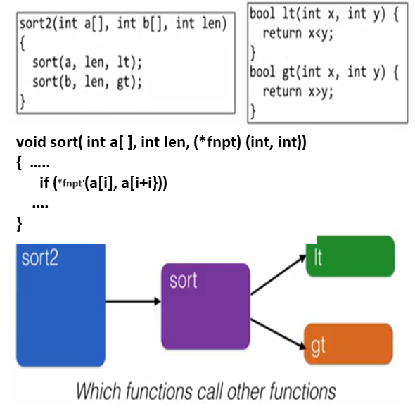
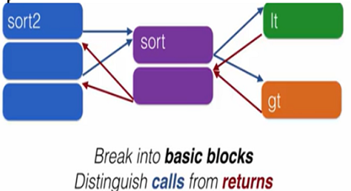
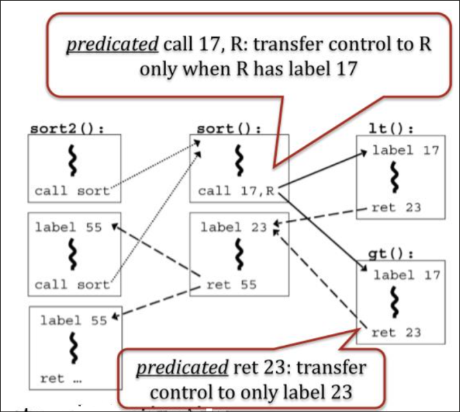

# Control Flow Integrity 

## What Makes a Process Safe?

- Memory Safety
    - Memory accesses are "correct" (respect array bounds, not executing data as if code)
- Control Flow Safety
    - All control transfers are envisioned by original program
    - No arbitrary jumps or calls that the original program did not call
- Type Safety
    - All function calls and operations have arguments of correct type

## Behavior Based Detection | Control Flow Integrity

How can we make sure that a program is executed in the intended way? A proposed solution is Control Flow Integrity (CFI)

Prevents attacks from redirecting the flow of execution of a program. Thus detecting and mitigates buffer overflow, ROP attacks and Ret2LibC attacks.

## CFI Overview

1. Build a Control Flow Graph (CFG) at compile time
2. Rewrite binary code of the program by adding identifiers (IDs), ID checks and IDs uniqueness (IRM)
3. Perform ID checks at run time so that indirect jumps have matching IDs (Randomness and Immutability)

## Control Flow Graphs

Define what expected behavior is, detect deviations from expectation efficiently, avoid compromise of the detector. The detector does the checking so needing to priorities the safety is a must.

We can use nodes as functions and directed arrows to see the path the function would take to get to other functions/nodes. 

Breaking it down more, we can see the flow of the program through the calls and returns from each function.

With this, we can see how the control flow of the program would work through the blue and red arrows depicted in the picture.

## In-Line Reference Monitor (IRM)

During load time, the IRM checks to see whether the CFI property is maintained. Direct function calls do not need to be monitored as they are in direct control (cannot be attacked). Indirect call returns need to be monitored as they are done through dynamic data on the stack.

The IRM, works as a program transformation (instrumentation).

- Insert a label before the target address of an indirect transfer
- Insert binary code that will check if the label of the target instruction matches the label of possible destination
- If not, abort. If so, continue.

## Overview CFI

Injecting code wont work, assuming non-executable data section.

Modifying code label for desired control flow will not work due to immutability. 
